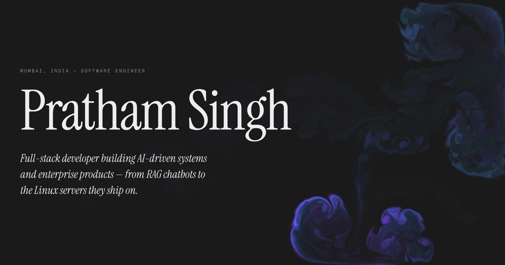

# Pratham Singh — Portfolio

Personal portfolio: a single-page, scroll-driven site built around a WebGL fluid
simulation. Quiet typography, loud interaction.

**Live:** [prathamsingh1805.netlify.app](https://prathamsingh1805.netlify.app/)



## Stack

- **[Vite](https://vite.dev)** + vanilla JavaScript — no framework, ~58 KB gzipped
- **[GSAP](https://gsap.com) + ScrollTrigger** — masked text reveals, scroll choreography
- **[Lenis](https://lenis.darkroom.engineering)** — smooth scrolling
- **[WebGL Fluid Simulation](https://github.com/PavelDoGreat/WebGL-Fluid-Simulation)** by Pavel Dobryakov (MIT) — vendored and modified
- **Instrument Serif / Geist / Geist Mono** — self-hosted via Fontsource

## How the fluid works

The simulation runs on a fixed, full-viewport canvas behind all content. Pointer
input is captured on `window`, so the cursor paints through the content layers
without any pointer-events tricks. The vendored sim is wrapped as an ES module
(`src/fluid/vendor-fluid.js`) with the palette constrained to violet/blue/cyan,
and all tuning lives in one config object at the top of `src/fluid/fluid.js` —
splat radius/force, dissipation, curl, bloom, brightness, and the idle-splat
interval that keeps the page alive without input.

Scroll choreography fades the canvas to 25% opacity through the middle sections
and restores it for the contact section — a bookend effect.

On devices without WebGL2, with low memory, or with `prefers-reduced-motion`,
the sim is replaced by a static gradient + grain background and all scroll
animations are disabled.

## Development

```bash
npm install
npm run dev      # dev server on :5173 (Node 20+)
npm run build    # production build to dist/
```

Deploys automatically to Netlify on push (`netlify.toml`).
